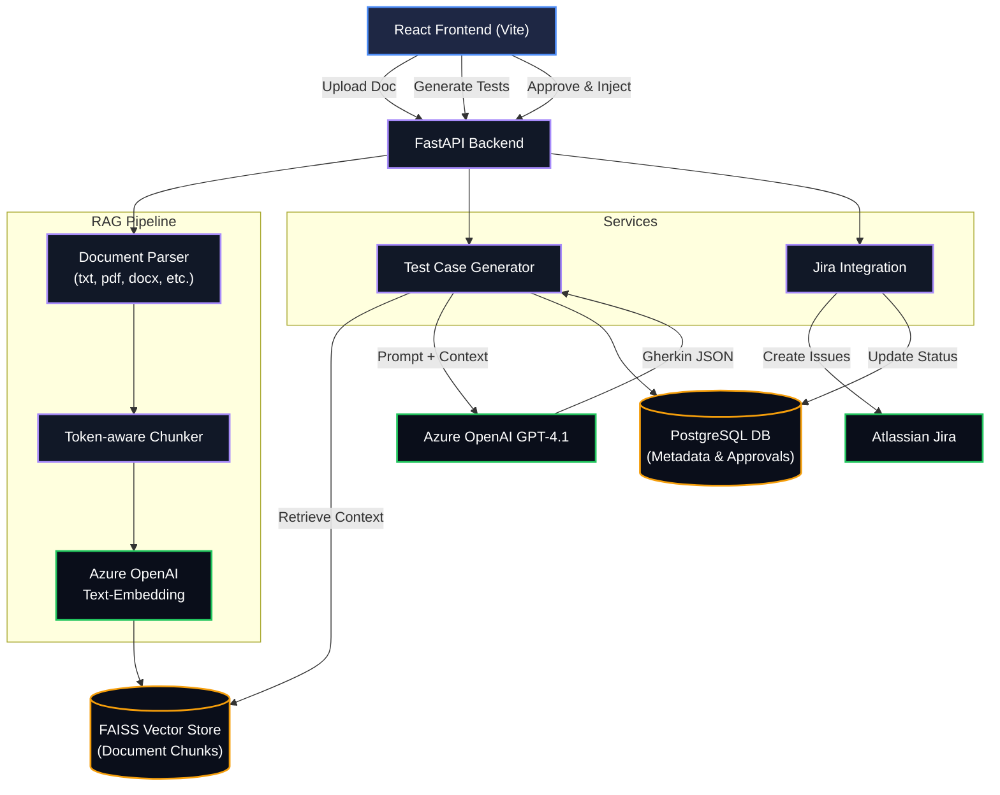

# AI-Powered Test Case Generation System (TestOrbit)

A full-stack Proof of Concept (PoC) that automates the generation of Gherkin test cases from structured and unstructured requirements documents using an Azure OpenAI GPT-4.1 and Retrieval Augmented Generation (RAG) pipeline. The system also features a QA approval workflow and direct Jira integration.

## 🌟 Features

*   **Multi-Format Document Ingestion:** Supports `.txt`, `.pdf`, `.docx`, `.json`, `.xlsx`, and `.csv` files.
*   **RAG Pipeline:** Utilizes token-aware chunking and Azure OpenAI `text-embedding-3-large` for semantic search, persisted via a local FAISS vector store.
*   **AI Test Generation:** Leverages Azure OpenAI GPT-4.1 to generate structured Gherkin test cases (Feature, Scenario, Given/When/Then) covering positive, negative, and edge cases.
*   **QA Approval Dashboard:** A modern, dark-themed React UI allows QA engineers to review, edit (via inline Monaco editor), approve, or reject generated test cases individually or in bulk.
*   **Jira Integration:** Automatically inject approved Gherkin scenarios directly into Jira as new issues.

## 🛠️ Tech Stack

*   **Backend:** FastAPI, Python 3.11+, SQLAlchemy, PostgreSQL, FAISS, Azure OpenAI API, Atlassian Jira API
*   **Frontend:** React (Vite), Axios, Tailwind CSS (custom CSS system), Monaco Editor, Lucide React
*   **Deployment:** Docker, Docker Compose

---

## 🚀 Getting Started

### Prerequisites

*   **Python 3.11+**
*   **Node.js 18+** & npm
*   **PostgreSQL 15+**
*   **Azure OpenAI API Key** and Endpoint (needs GPT-4.1 and text-embedding models)
*   **Jira API Token** and Base URL

### 1. Environment Configuration

The repository includes a `.env.template` file in the `backend/` directory.

1.  Copy `backend/.env.template` to `backend/.env`.
2.  Fill in your specific Azure OpenAI, Database, and Jira credentials. **Never commit your actual `.env` file to version control.**

*Note: For the frontend, a `.env` file is already provided setting `VITE_API_BASE_URL=http://localhost:8000/api/v1`.*

### 2. Running Locally (Development Mode)

Two convenience batch scripts are provided for Windows users to launch the services quickly.

#### Start the Backend
Double-click `start_backend.bat`, or run manually:
```bash
cd backend
python -m venv venv
venv\Scripts\activate  # On Windows
pip install -r requirements.txt
python main.py

```
*   **API URL:** http://localhost:8000/api/v1
*   **Swagger Docs:** http://localhost:8000/api/docs

#### Start the Frontend
Open a new terminal and double-click `start_frontend.bat`, or run manually:
```bash
cd frontend
npm install
npm run dev
```
*   **UI URL:** http://localhost:5173

### 3. Running via Docker Compose (Alternative)

If you prefer using Docker to run the entire stack (including a local PostgreSQL instance):

```bash
docker-compose up --build
```
This will spin up the `postgres`, `backend` (port 8000), and `frontend` (port 5173 via Nginx) services.

---

## 📖 Usage Guide

1.  **Upload Requirements:** Navigate to the **Upload** tab in the UI. Drag and drop your requirement documents (e.g., a Jira export PDF or a Word doc).
2.  **Generate Scenarios:** Once the document status shows as "ready" (meaning it has been parsed, chunked, and embedded), select the domain (Web, API, Mobile, etc.), set the desired number of test cases, provide any extra context, and click **Generate**.
3.  **Review and Edit:** Switch to the **Review** tab. You will see the generated scenarios. You can edit the Gherkin text directly using the inline code editor, and mark them as Approved or Rejected.
4.  **Inject to Jira:** Go to the **Jira** tab. Configure your Jira settings (if you haven't set them in the `.env`), test the connection, and click Inject. Approved test cases will be created as Jira issues, and the Jira link will appear on the test case card.

---

## 🏛️ Architecture Overview

The system follows a 3-tier architecture with an event-driven RAG pipeline for test case generation:



1.  **React Frontend (Vite):** A SPA that communicates via REST with the backend.
2.  **FastAPI Backend:** Handles document parsing, RAG coordination, LLM prompting, and Jira API calls.
    *   **Parser & Chunker:** Extracts text from files and splits it intelligently.
    *   **Embedder & Vector Store:** Generates embeddings via Azure OpenAI and stores them in FAISS.
    *   **Generator:** Retrieves relevant chunks from FAISS based on the user's domain/context and prompts GPT-4.1.
3.  **Database Layer:** Azure PostgreSQL stores document metadata, generated test cases, Jira configurations, and an audit log of QA reviews.

---

## 🧪 Testing

Pytest is used for backend unit testing.

```bash
cd backend
venv\Scripts\activate
pytest
```
Tests cover: document upload/parsing, text chunking limitations, generation payload parsing, and approval status logic.
